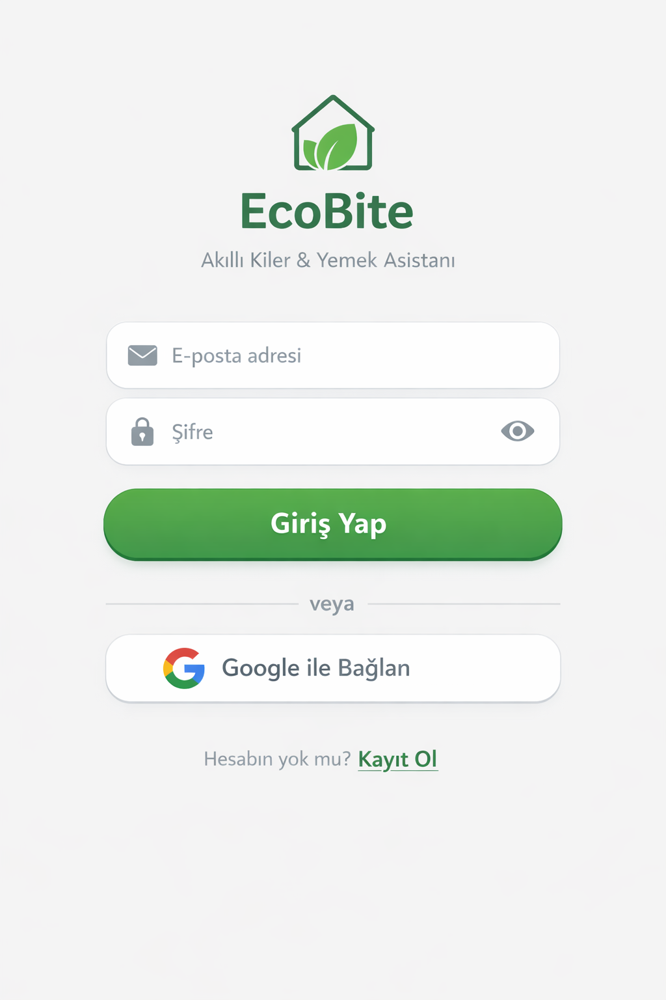
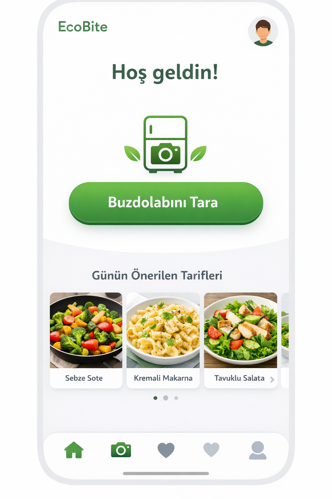
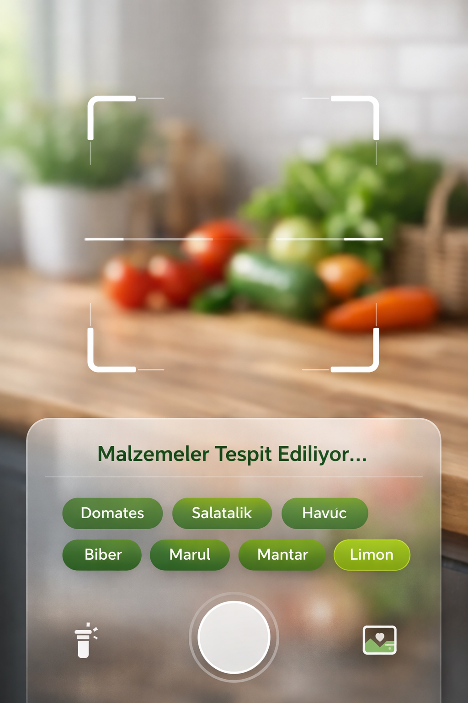
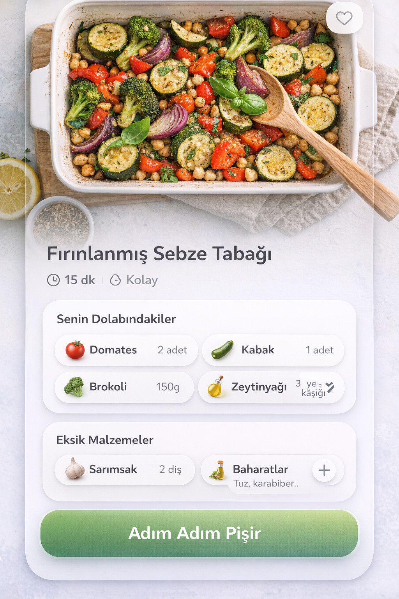
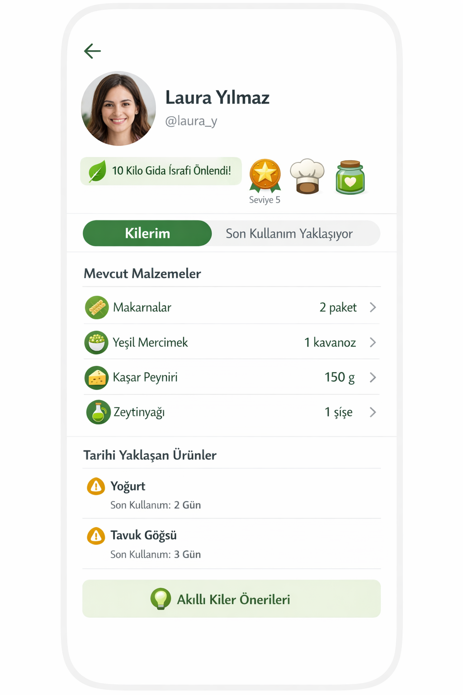
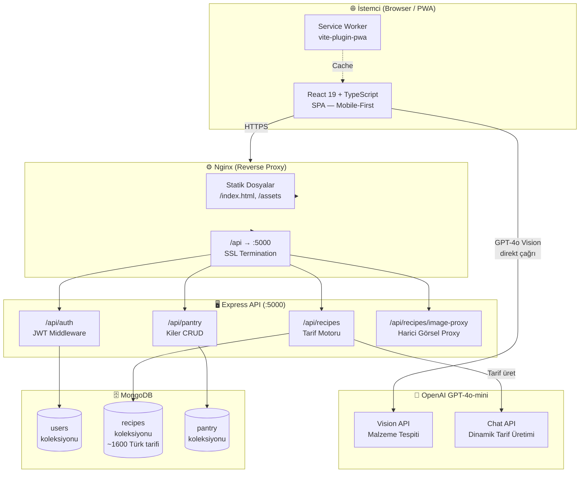

<div align="center">


# EcoBite

**Akıllı Kiler & Yemek Asistanı**

Buzdolabındakileri kamerayla tara, yapay zeka ile anlık tarif önerileri al, gıda israfını önle.

[](https://react.dev)
[](https://www.typescriptlang.org)
[](https://vitejs.dev)
[](https://tailwindcss.com)
[](https://nodejs.org)
[](https://www.mongodb.com)
[](https://www.docker.com)
[](https://openai.com)

</div>

---

## 📱 Ekran Görüntüleri

<div align="center">
<table>
  <tr>
    <td align="center">
      
      <br /><sub><b>Giriş & Kayıt</b></sub>
    </td>
    <td align="center">
      
      <br /><sub><b>Ana Sayfa</b></sub>
    </td>
    <td align="center">
      
      <br /><sub><b>AI Kamera Tarama</b></sub>
    </td>
    <td align="center">
      
      <br /><sub><b>Tarif Detayı</b></sub>
    </td>
    <td align="center">
      
      <br /><sub><b>Profil & Kiler</b></sub>
    </td>
  </tr>
</table>
</div>

---

## 🌿 Proje Hakkında

**EcoBite**, evdeki malzemeleri en verimli şekilde değerlendirmek isteyen kullanıcılar için geliştirilmiş yapay zeka destekli bir mobil web uygulamasıdır.

### Çözülen Problem

> *"Evde ne var bilmiyorum, markete mi gitsem?"*  
> *"Bu malzemelerle ne pişirebilirim?"*  
> *"Buzdolabındaki şeyler bozulmadan önce kullansam iyi olur..."*

EcoBite bu üç sorunu tek bir akıllı akışla çözüyor: **tara → tespit et → pişir**.

### Hedef Kitle

| Kitle | Kazanım |
|-------|---------|
| 🎓 Öğrenciler | Kısıtlı bütçeyle sağlıklı ve hızlı yemek |
| 💼 Çalışanlar | Zamandan tasarruf, günlük "ne pişirsem" kararsızlığının sonu |
| 🌍 Çevre bilinci yüksek bireyler | Gıda israfını azaltma, sürdürülebilir tüketim |

---

## ✨ Özellikler

### 🤖 Yapay Zeka ile Malzeme Tespiti
- Kamera ile buzdolabını veya malzemeleri tara
- GPT-4o-mini görseli analiz eder, içerikleri Türkçe+İngilizce listeler
- Galeriden fotoğraf yükleme desteği
- Fener (torch) kontrolü, AR görünüm çerçevesi

### 🍽️ Akıllı Tarif Önerileri
- Tespit edilen malzemelere göre anlık tarif araması
- Kategorilere göre günlük tarifler (Kahvaltı, Öğle, Akşam, Vegan, Tatlı)
- "Akıllı Kiler" modu: Son kullanma tarihi yaklaşan ürünleri önceliklendirir
- "En Uygun" / "En Hızlı" sıralama seçenekleri

### 📦 Kiler Yönetimi
- Kameradan veya manuel ekleme
- Son kullanma tarihi takibi ve uyarıları
- Miktar ve birim yönetimi (g, kg, ml, l, adet…)
- Eksik malzemeleri tek tıkla kilere ekle

### 🏆 Gamification Sistemi
- Her tamamlanan tarif için XP kazanma
- Seviye atlama sistemi
- Son kullanımı yaklaşan ürünleri kullanınca bonus XP
- Kg cinsinden önlenen gıda israfı takibi
- Günlük giriş serisi (streak)

### 🎨 Tasarım & Deneyim
- Mobile-first, PWA desteği
- Glassmorphism kamera arayüzü
- Framer Motion ile sayfa geçişleri ve animasyonlar
- Sonsuz scroll ile tarif keşfi
- Özel tarif ekleme

---

## 🏗️ Mimari

### Genel Sistem Mimarisi



---

### Frontend Katmanı

```
src/
├── pages/                        # Rota bazlı sayfa bileşenleri
│   ├── LoginPage.tsx             # E-posta/şifre girişi, kayıt, demo modu
│   ├── HomePage.tsx              # Kategorili günlük tarif akışı
│   ├── CameraScanPage.tsx        # Canlı kamera, AI analiz, AR viewfinder
│   ├── RecipesResultsPage.tsx    # Malzeme bazlı tarif sonuçları
│   ├── RecipeDetailPage.tsx      # Tarif detayı, kiler eşleştirme, adım adım pişirme
│   ├── AllRecipesPage.tsx        # Sayfalı genel tarif kataloğu
│   ├── FavoritesPage.tsx         # Kaydedilen tarifler
│   ├── AddRecipePage.tsx         # Özel tarif oluşturma
│   └── ProfilePantryPage.tsx     # Profil, kiler, son kullanım uyarıları
│
├── hooks/                        # İş mantığını kapsayan custom hook'lar
│   ├── useAuth.ts                # JWT oturumu, giriş/çıkış/kayıt, demo akışı
│   ├── usePantry.ts              # Kiler CRUD + optimistic update + 30s polling
│   └── useRecipes.ts             # Günlük tarif yükleme, malzeme araması
│
├── store/
│   └── useAppStore.ts            # Zustand global state
│                                 # • Kullanıcı profili & XP sistemi
│                                 # • Kategorize günlük tarifler (5 kategori)
│                                 # • Kiler snapshot
│                                 # • Taranmış malzemeler
│                                 # • persist middleware → localStorage
│
├── api/                          # Dış servis adaptörleri
│   ├── apiClient.ts              # Axios instance — baseURL + JWT header interceptor
│   ├── firebase.ts               # Backend REST köprüsü (pantry, favoriler, profil)
│   ├── openaiVision.ts           # GPT-4o Vision — base64 görsel → malzeme listesi
│   └── ownApi.ts                 # Tarif endpoint'leri (günlük, arama, tümü)
│
├── components/
│   ├── layout/
│   │   ├── ProtectedRoute.tsx    # JWT guard — giriş yoksa /login'e yönlendir
│   │   ├── BottomNav.tsx         # Ana navigasyon çubuğu (4 sekme)
│   │   ├── TopBar.tsx            # Başlık çubuğu
│   │   └── PageWrapper.tsx       # Sayfa sarmalayıcı (padding, scroll)
│   ├── features/
│   │   └── RecipeCard.tsx        # Tarif kartı (görsel, başlık, süre)
│   └── ui/
│       ├── Button.tsx            # Varyantlı buton (primary, outline, gradient)
│       ├── Input.tsx             # İkon destekli, şifre toggle'lı input
│       └── Modal.tsx             # Alt sheet modal
│
├── utils/
│   ├── emojiMap.ts               # Türkçe malzeme adı → emoji (hızlı lookup)
│   ├── ingredientMapper.ts       # Gelişmiş emoji eşleştirme
│   │                             # • Türkçe karakter normalizasyonu (ğ→g, ş→s…)
│   │                             # • Çok turlu eşleştirme (tam, kısmi, suffix)
│   └── recipeUtils.ts            # matchPantryToRecipe — kiler vs tarif malzemeleri
│
└── types/index.ts                # Paylaşılan TypeScript arayüzleri
                                  # PantryItem | Recipe | User | DetectedIngredient
```

---

### Backend Katmanı

```
backend/
├── server.js                     # Express başlatma, middleware, route mount
│                                 # • CORS, JSON body parser
│                                 # • MongoDB bağlantısı (Mongoose)
│                                 # • PORT: 5000
│
├── routes/
│   ├── auth.js                   # Kullanıcı modeli + kimlik doğrulama
│   │   ├── User şeması           # email, password (bcrypt), displayName,
│   │   │                         # level, xp, streak, totalKgSaved,
│   │   │                         # dailyRecipes (5 kategori cache), favorites[]
│   │   ├── POST /register        # bcrypt hash, JWT üret
│   │   ├── POST /login           # Şifre karşılaştır, streak hesapla, JWT üret
│   │   ├── GET  /me              # Token doğrula, profil döndür
│   │   └── PUT  /stats           # XP, seviye, günlük tarif cache güncelle
│   │
│   ├── pantry.js                 # Kullanıcıya ait kiler öğeleri
│   │   ├── Pantry şeması         # name, quantity, unit, emoji,
│   │   │                         # category, expiryDate, userId
│   │   ├── GET    /pantry        # Kullanıcının kiler öğelerini listele
│   │   ├── POST   /pantry        # Yeni öğe ekle
│   │   ├── PUT    /pantry/:id    # Öğe güncelle
│   │   └── DELETE /pantry/:id   # Öğe sil
│   │
│   └── recipes.js                # Tarif motoru
│       ├── GET  /daily           # Günlük tarif cache kontrolü
│       │                         # → Bugün için zaten varsa cache'den döndür
│       │                         # → Yoksa DB'den Türkçe tag regex ile 3'er tarif çek
│       │                         # → Kullanıcı profiline kaydet (kalıcı cache)
│       ├── POST /smart-search    # Malzeme bazlı akıllı arama
│       │                         # → DB'de regex ile eşleştir
│       │                         # → Eşleşme yoksa GPT-4o-mini ile tarif üret
│       ├── GET  /all             # Sayfalı tarif kataloğu (kategori filtresi)
│       ├── GET  /saved           # Kullanıcı favorileri
│       ├── POST /save            # Favoriye ekle
│       ├── DELETE /unsave/:id   # Favoriden çıkar
│       ├── GET  /image-proxy    # Hotlink korumayı aşmak için görsel proxy
│       │                         # → User-Agent spoofing, 7 günlük cache header
│       └── GET  /:id            # Tarif detayı (string ID ile)
│
├── models/
│   └── Recipe.js                 # Tarif MongoDB şeması
│                                 # id (custom string), title, image,
│                                 # readyInMinutes, difficulty, summary,
│                                 # extendedIngredients[], analyzedInstructions[],
│                                 # tags[] (kategori etiketleri)
└── utils/
    └── imageUtils.js             # Görsel URL yönetimi
                                  # • fetchScrapedImage — web'den tarif görseli bul
                                  # • getStableImageUrl — anahtar kelime tabanlı fallback
```

---

### Veri Akışı: Kamera → Tarif

```
Kullanıcı fotoğraf çeker
        │
        ▼
[CameraScanPage] canvas.toDataURL() → base64 JPEG
        │
        ▼
[openaiVision.ts] GPT-4o-mini Vision API
  Prompt: "Görseldeki yiyecekleri Türkçe+İngilizce JSON olarak listele"
        │
        ▼
DetectedIngredient[] → Zustand store (scannedIngredients)
        │
        ▼
[RecipesResultsPage] useRecipes.searchByIngredients()
        │
        ▼
[ownApi.ts] POST /api/recipes/smart-search  { ingredients: string[] }
        │
        ├─ DB'de eşleşme var → recipes[] döner
        │
        └─ DB'de eşleşme yok → GPT-4o-mini tarif üretir → DB'ye kaydeder → döner
        │
        ▼
RecipeCard listesi → Kullanıcı tarife tıklar
        │
        ▼
[RecipeDetailPage] /api/recipes/:id
  • matchPantryToRecipe() → "Senin Dolabındakiler" / "Eksik Malzemeler"
  • "Adım Adım Pişir" → Modal → XP kazanım
```

---

### Kimlik Doğrulama Akışı

```
[Giriş]  email + password
    │
    ▼
POST /api/auth/login
    │  bcrypt.compare() → eşleşme
    │  streak hesaplama (son giriş farkı)
    ▼
JWT (7 gün geçerli) → localStorage
    │
    ▼
Zustand store → user state
    │
    ▼
ProtectedRoute → <Outlet /> (korumalı sayfalar)

Her API isteğinde:
apiClient interceptor → headers['x-auth-token'] = JWT
```

---

### Proje Dizin Yapısı

```
EcoBite/
├── src/                    # Frontend (React + TypeScript)
├── backend/                # API sunucusu (Node.js + Express)
│   ├── models/
│   ├── routes/
│   └── utils/
├── public/                 # Statik dosyalar (favicon, PWA ikonları)
├── nginx/
│   └── nginx.conf          # Reverse proxy konfigürasyonu
├── Dockerfile              # Frontend build → Nginx image
├── backend/Dockerfile      # Backend Node.js image
└── docker-compose.yml      # 3 servis: app + backend + mongodb
```

---

## 🛠️ Teknoloji Yığını

### Frontend
| Teknoloji | Versiyon | Kullanım |
|-----------|----------|----------|
| React | 19 | UI framework |
| TypeScript | 5.9 | Tip güvenliği |
| Vite | 8 | Build tool & dev server |
| Tailwind CSS | 3.4 | Utility-first CSS |
| Framer Motion | 12 | Animasyonlar |
| Zustand | 5 | Global state yönetimi |
| React Router | 7 | Client-side routing |
| Axios | 1.x | HTTP istekleri |
| Lucide React | — | İkon seti |

### Backend
| Teknoloji | Kullanım |
|-----------|----------|
| Node.js + Express | REST API sunucusu |
| MongoDB + Mongoose | Veri tabanı |
| JWT (jsonwebtoken) | Kimlik doğrulama |
| bcryptjs | Şifre hashleme |
| Axios | OpenAI API çağrıları |

### Yapay Zeka
| Servis | Model | Kullanım |
|--------|-------|----------|
| OpenAI | GPT-4o-mini (Vision) | Kameradan malzeme tespiti |
| OpenAI | GPT-4o-mini (Text) | Dinamik tarif üretimi |

### Altyapı
| Araç | Kullanım |
|------|----------|
| Docker + Compose | Container orkestrasyonu |
| Nginx | Reverse proxy, HTTPS, SPA routing |
| vite-plugin-pwa | PWA manifest & service worker |

---

## 🚀 Kurulum

### Ön Gereksinimler

- [Node.js](https://nodejs.org) ≥ 18
- [Docker Desktop](https://www.docker.com/products/docker-desktop/) (Docker ile çalıştırma için)
- [MongoDB](https://www.mongodb.com) (yerel veya Atlas)
- [OpenAI API anahtarı](https://platform.openai.com)

---

### Yöntem 1 — Yerel Geliştirme

**1. Repoyu klonla**
```bash
git clone https://github.com/Omerfaruk-aydn/EcoBite-app.git
cd EcoBite-app
```

**2. Ortam değişkenlerini ayarla**
```bash
cp .env.example .env
```
`.env` dosyasını düzenle:
```env
VITE_API_URL=/api
VITE_OPENAI_API_KEY=sk-proj-...   # OpenAI anahtarın
```

**3. Frontend bağımlılıklarını yükle ve başlat**
```bash
npm install
npm run dev
```

**4. Backend'i başlat (ayrı terminal)**
```bash
cd backend
npm install
JWT_SECRET=güçlü-bir-secret MONGODB_URI=mongodb://localhost:27017/ecobite OPENAI_API_KEY=sk-proj-... node server.js
```

Uygulama `https://localhost:5173` adresinde çalışacak.

---

### Yöntem 2 — Docker Compose (Önerilen)

Tüm servisler (frontend + backend + MongoDB) tek komutla ayağa kalkar.

**1. `.env` dosyasını hazırla** (yukarıdaki gibi)

**2. SSL sertifikası oluştur** (geliştirme için self-signed)
```bash
mkdir -p nginx/certs
openssl req -x509 -nodes -days 365 -newkey rsa:2048 \
  -keyout nginx/certs/localhost.key \
  -out nginx/certs/localhost.crt \
  -subj "/CN=localhost"
```

**3. Ortam değişkenlerini `.env`'e ekle**
```env
VITE_API_URL=/api
VITE_OPENAI_API_KEY=sk-proj-...
JWT_SECRET=en-az-32-karakter-güçlü-bir-secret
```

**4. Başlat**
```bash
docker compose up --build
```

Uygulama `https://localhost` adresinde çalışacak.

---

## 🔑 Ortam Değişkenleri

| Değişken | Gerekli | Açıklama |
|----------|---------|----------|
| `VITE_OPENAI_API_KEY` | ✅ | Kamera malzeme tespiti için OpenAI anahtarı |
| `VITE_API_URL` | ✅ | Backend API temel URL'i (varsayılan: `/api`) |
| `JWT_SECRET` | ✅ *(backend)* | JWT token imzalama anahtarı — güçlü ve gizli tutulmalı |
| `MONGODB_URI` | ✅ *(backend)* | MongoDB bağlantı dizesi |
| `OPENAI_API_KEY` | ✅ *(backend)* | Dinamik tarif üretimi için OpenAI anahtarı |

> ⚠️ `.env` dosyasını asla Git'e commit etme. `.gitignore` tarafından korunmaktadır.

---

## 📖 API Dokümantasyonu

### Kimlik Doğrulama

| Method | Endpoint | Açıklama |
|--------|----------|----------|
| `POST` | `/api/auth/register` | Yeni kullanıcı kaydı |
| `POST` | `/api/auth/login` | Giriş yap, JWT döner |
| `GET` | `/api/auth/me` | Mevcut kullanıcı profili |
| `PUT` | `/api/auth/stats` | XP, seviye, istatistik güncelle |

### Kiler

| Method | Endpoint | Açıklama |
|--------|----------|----------|
| `GET` | `/api/pantry` | Kiler öğelerini listele |
| `POST` | `/api/pantry` | Yeni öğe ekle |
| `PUT` | `/api/pantry/:id` | Öğe güncelle |
| `DELETE` | `/api/pantry/:id` | Öğe sil |

### Tarifler

| Method | Endpoint | Açıklama |
|--------|----------|----------|
| `GET` | `/api/recipes/daily?type=breakfast` | Günlük kategorize tarifler |
| `POST` | `/api/recipes/smart-search` | Malzemeye göre tarif ara |
| `GET` | `/api/recipes/all?category=vegan&page=1` | Sayfalı tarif listesi |
| `GET` | `/api/recipes/saved` | Favorileri getir |
| `POST` | `/api/recipes/save` | Favoriye ekle |
| `DELETE` | `/api/recipes/unsave/:id` | Favoriden çıkar |
| `GET` | `/api/recipes/image-proxy?url=...` | Harici görsel proxy |
| `GET` | `/api/recipes/:id` | Tarif detayı |

> Tüm `/api/pantry` ve favoriler endpoint'leri `x-auth-token` header'ı gerektirir.

---

## 🤝 Katkıda Bulunma

1. Repoyu fork edin
2. Feature branch oluşturun: `git checkout -b feature/yeni-ozellik`
3. Değişikliklerinizi commit edin: `git commit -m 'feat: yeni özellik eklendi'`
4. Branch'i push edin: `git push origin feature/yeni-ozellik`
5. Pull Request açın

---

## 📄 Lisans

Bu proje [MIT Lisansı](LICENSE) altında lisanslanmıştır.

---

<div align="center">

**EcoBite** — Daha az israf, daha çok lezzet. 🌿

*Geliştirici: [Ömer Faruk Aydın](https://github.com/Omerfaruk-aydn)*

</div>
